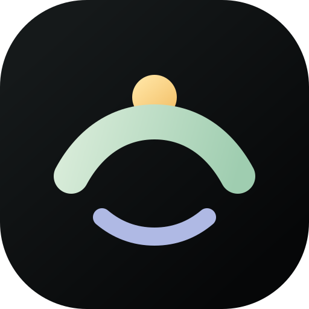

# FocusIsland

FocusIsland is a lightweight, offline-first productivity island for Windows and macOS. It lives at the top center of a monitor as a compact timer pill and expands into a focused workspace for tasks, countdowns, stopwatch sessions, daily notes, reminders, insights, and appearance settings.

FocusIsland is free and open-source software released under the MIT License. It has no accounts, cloud dependency, analytics, or telemetry.

[Download the latest release for Windows or macOS](https://github.com/vishvajeet2012/FocusIsland/releases/latest)

The product name and shared brand icon path shown in the frontend are isolated in [`src/lib/constants.ts`](src/lib/constants.ts). The original SVG source of truth is [`static/app-icon.svg`](static/app-icon.svg), with native icon sizes generated from it. Native runtime strings are grouped in `src-tauri/src/constants.rs`, while installer identity metadata lives in `src-tauri/tauri.conf.json` as required by Tauri.

## Features

- Top-center, borderless, transparent, always-on-top desktop utility window
- Per-monitor work-area positioning and DPI-aware sizing on Windows and macOS
- Hybrid island animation: one native host resize per transition plus a CSS inner-shell morph
- Task create, edit, complete, restore, delete, duplicate, archive, reminder, focus, and drag reorder flows
- Drift-free countdown and stopwatch modes calculated from persisted timestamps
- Timer recovery after collapse, app restart, and computer sleep/wake
- Daily notepad with 450 ms autosave and `Ctrl + Enter` line-to-task conversion
- Local reminder scheduler and native system notifications
- SQLite-backed focus sessions and real seven-day insights
- Custom colors, theme, island behavior, monitor policy, motion level, notifications, time format, and startup settings
- Native system tray/menu bar, three global shortcuts, and compact quick-task island
- No analytics, telemetry, accounts, cloud calls, or normal-operation network dependency

## Download

Open the [latest release](https://github.com/vishvajeet2012/FocusIsland/releases/latest) and choose the download for your computer:

- `FocusIsland_0.2.0_x64-setup.exe` for the recommended per-user Windows installer.
- `FocusIsland.exe` for a portable launch without installation.
- `SHA256SUMS.txt` to verify either download.
- `FocusIsland_0.2.0_universal.dmg` for macOS, supporting Intel and Apple Silicon.

The Windows edition targets 64-bit Windows 10/11 and requires the Microsoft Edge WebView2 Runtime. The macOS edition targets macOS 12 or later and is built as a Universal 2 app for Intel and Apple Silicon. Release binaries are not yet code-signed/notarized, so Windows SmartScreen or macOS Gatekeeper may show a warning.

## Tech stack

- Tauri 2 and Rust
- Svelte 5, strict TypeScript, SvelteKit static adapter, and Vite
- Plain CSS and original SVG branding/icons
- SQLite through `rusqlite` with bundled SQLite
- Tauri notification, global-shortcut, and autostart plugins
- `windows-rs` for Windows monitor work areas and effective DPI; Tauri's native monitor APIs for macOS

No Electron runtime, UI framework, animation library, chart package, date library, icon pack, or background server is used.

## Development setup

Requirements: Windows 10/11 with WebView2 and Visual Studio 2022 Build Tools, or macOS 12+ with Xcode Command Line Tools. Both need Node.js 20+ and Rust stable. Use a Mac to build or run the macOS app.

```powershell
cd C:\path\to\FocusIsland
npm install
npm run tauri dev
```

Frontend-only validation:

```powershell
npm run check
npm run build
npm run preview
```

## Production builds

```powershell
npm install
npm run check
npm run build
cargo test --manifest-path src-tauri\Cargo.toml
npm run tauri -- build
```

On Windows, the configured target is a per-user NSIS installer at `src-tauri\target\release\bundle\nsis\`. On macOS, create an Intel + Apple Silicon Universal 2 DMG with:

```sh
npm install
npm run check
npm run build
cargo test --manifest-path src-tauri/Cargo.toml
npm run tauri -- build --target universal-apple-darwin --bundles dmg
```

Tauri writes the DMG to `src-tauri/target/universal-apple-darwin/release/bundle/dmg/`. GitHub Actions builds both platform packages for each version tag.

Windows release copies from the local build are available in `artifacts\`: the NSIS installer and standalone executable. Public tagged releases include both Windows downloads, checksums, and the macOS Universal 2 DMG. Production distribution should sign and notarize binaries with the publisher's platform certificates.

## Keyboard shortcuts

| Action | Shortcut |
| --- | --- |
| Toggle workspace | `Ctrl + Alt + Space` |
| Quick add task | `Ctrl + Alt + T` |
| Start / pause / resume timer | `Ctrl + Alt + P` |
| Focus quick task input | `Ctrl + N` |
| Convert current note line to a task | `Ctrl + Enter` |
| Collapse / close transient UI | `Esc` |
| Toggle timer when its card is focused | `Space` |

Global shortcut registration failures are non-fatal and appear in Customize.

## Local data

The SQLite database is stored in Tauri's platform app-data folder as `focusisland.sqlite3` (Windows: `%APPDATA%\com.focusisland.desktop\`; macOS: `~/Library/Application Support/com.focusisland.desktop/`).

SQLite runs in WAL mode with foreign keys, normal synchronous durability, a busy timeout, and indexed deadline/date queries. A storage failure falls back to an in-memory database and surfaces a warning instead of producing a blank screen.

- `tasks` stores task text, status, ordering, due/reminder metadata, focus estimate, and archive timestamps.
- `daily_notes` stores one upserted note per local calendar date.
- `focus_sessions` stores completed countdown/stopwatch records used by Insights.
- `reminders` stores pending and fired local deadlines.
- `settings` stores validated JSON preferences under one key.
- `timer_state` stores one durable timer with start, pause, accumulated-pause, mode, target, and task context.
- `schema_migrations` tracks applied schema versions.

## Architecture

```text
src/
  components/        island, workspace, task, timer, note, event, and common UI
  stores/            small Svelte stores for predictable UI state
  lib/               typed native bridge, time math, formatting, constants, motion helpers
  types/             strict frontend domain types
  views/             Workspace, Insights, and Customize

src-tauri/src/
  commands/          narrow, validated Tauri command boundary
  db/                schema and domain repositories
  windows/           DPI-aware Windows/macOS monitor positioning and window operations
  notifications/     native notification construction
  shortcuts/         registration, failure reporting, and event routing
  tray/              native menu and double-click handling
  scheduler.rs       condition-variable deadline scheduler
```

The frontend never executes SQL. Rust validates every command input before it reaches SQLite.

### Window animation strategy

Expansion does not resize the native window on every frame. Rust first enlarges and re-centers the transparent host once. On the next two animation frames, the inner shell morphs from the existing pill dimensions to the workspace with `width`, `height`, `border-radius`, `opacity`, and small translations. Collapse reverses the inner animation and shrinks the native host after it finishes. This avoids high-frequency IPC and Win32 resize jank while preserving the impression of one continuous object.

Motion variables are centralized in `src/app.css`; Customize and `prefers-reduced-motion` can reduce or disable transitions.

### Timer and scheduler behavior

The UI never treats an interval counter as the source of truth. Remaining or elapsed time is calculated from `reference_time - started_at - accumulated_pause_ms`. The one-second UI timeout is aligned to wall-clock boundaries and exists only while a timer is running. Native reminders and countdown completion use a condition variable that sleeps until the nearest persisted deadline and wakes only when a deadline changes. After suspend/resume it immediately reconciles against system time.

## Verification

Repository tests cover task persistence and completion, daily note restoration, settings round trips, reminder persistence, timer timestamp reconciliation, pause exclusion, focus-session creation, and Insights updates. The production checklist verifies task/note/settings persistence, completion-driven Insights, collapse/restart/sleep timer correctness, native reminders, shortcuts on a second monitor, motion-off behavior, and tray process exit.

## Privacy and security

FocusIsland is entirely local. It makes no analytics or telemetry calls and has no account or cloud subsystem. Tauri capabilities expose only core window/event functionality; all mutation goes through explicit commands with length, range, enum, date, and color validation. No shell execution API is exposed to the webview.

On macOS, FocusIsland behaves as a menu bar utility and stays out of the Dock. Use the menu bar icon or the global shortcut to show the island, and choose Quit from the menu bar menu to exit.

## Contributing

Issues, bug reports, and pull requests are welcome. Before opening a pull request, run:

```powershell
npm install
npm run check
npm run build
cargo test --manifest-path src-tauri\Cargo.toml
```

Please keep new dependencies small, preserve offline-first behavior, and avoid adding telemetry or cloud requirements.

## License

FocusIsland is licensed under the [MIT License](LICENSE).

Copyright (c) 2026 Vishvajeet Shukla.
